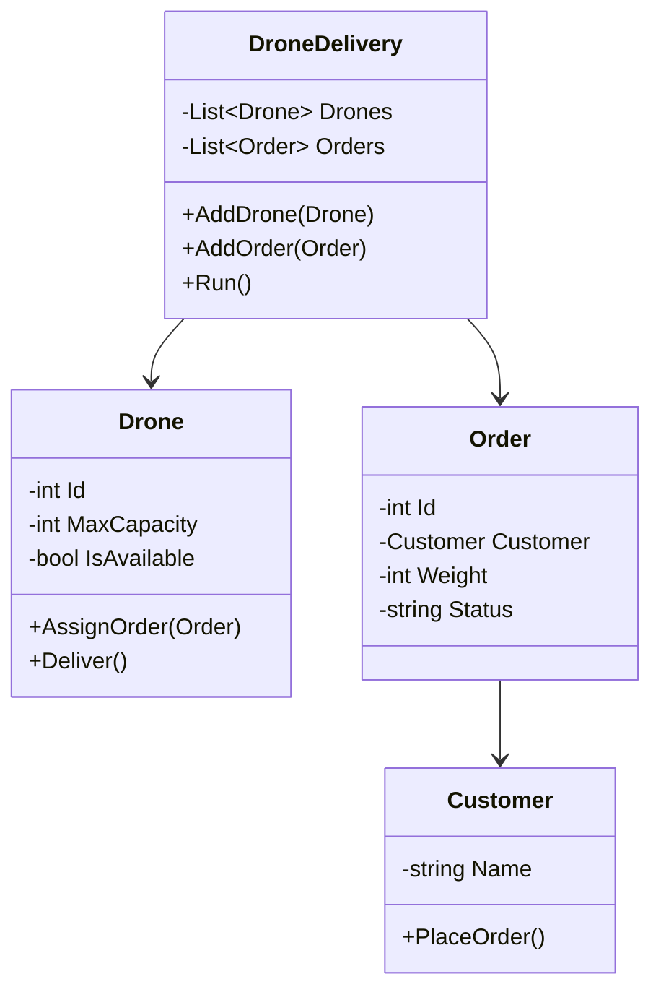

# 🚁 Drone Delivery Simulation

A **C# project** simulating a drone-based delivery system.  
This project demonstrates **software engineering principles** such as clean Object-Oriented Design, modular architecture, and test-driven development practices.

---

## 📖 Table of Contents
- [Overview](#-overview)
- [Features](#-features)
- [Project Structure](#-project-structure)
- [Getting Started](#-getting-started)
- [Code Example](#-code-example)
- [Architecture](#-architecture)
- [Tests](#-tests)
- [Future Improvements](#-future-improvements)
- [License](#-license)

---

## 🔎 Overview
The **Drone Delivery System** simulates real-world package delivery using autonomous drones.  
It covers the process from **order placement** by customers, to **drone assignment** and **successful delivery**.

This project highlights:
- Object-Oriented Programming (OOP) design.
- Encapsulation of business logic in dedicated classes.
- Unit testing of core functionalities.
- Extendable architecture for future improvements.

---

## ✨ Features
- 📦 **Order Management** – customers can place and track orders.  
- 🚁 **Drone Scheduling** – automatically assigns available drones to deliveries.  
- ⏳ **Simulation Engine** – step-by-step simulation of drone operations.  
- ✅ **Unit Tests** – validating system correctness.  

---

## 📂 Project Structure
```
Drone-delivery/
│── Drone.cs           # Drone entity
│── Customer.cs        # Customer entity
│── Order.cs           # Order entity
│── DroneDelivery.cs   # Core delivery logic
│── Program.cs         # Entry point (simulation runner)
│── Tests/             # Unit tests
```

---

## 🚀 Getting Started

### Prerequisites
- [.NET 6.0 SDK](https://dotnet.microsoft.com/en-us/download) or later
- Visual Studio / VS Code with C# extension

### Installation
```bash
git clone https://github.com/asafbigel/Drone-delivery.git
cd Drone-delivery
```

### Run the Simulation
```bash
dotnet run
```

### Run Unit Tests
```bash
dotnet test
```

---

## 🧩 Code Example

```csharp
// Create a new drone
Drone drone = new Drone(id: 1, maxCapacity: 5);

// Create a customer and an order
Customer customer = new Customer("Alice");
Order order = new Order(id: 101, customer, weight: 3);

// Assign the order to a drone delivery system
DroneDelivery system = new DroneDelivery();
system.AddDrone(drone);
system.AddOrder(order);

// Start the simulation
system.Run();
```

---

## 🏗 Architecture

The system is built using **OOP principles** with clear separation of concerns:



---

## 🧪 Tests
The project includes unit tests for:
- Drone assignment logic  
- Order creation and tracking  
- Simulation flow  

Run with:
```bash
dotnet test
```

---

## 🔮 Future Improvements
- 📊 **Advanced Scheduling** – use shortest path, priority queues, or load balancing.  
- 🌍 **Geolocation Support** – simulate real maps and delivery distances.  
- 🔋 **Battery Management** – model drone battery and charging cycles.  
- 🌐 **UI / Dashboard** – visualize drones and orders in real-time.  
- ☁ **Cloud Integration** – connect to external APIs for scalability.  

---

## 📜 License
This project is licensed under the MIT License.  
Feel free to use, modify, and share it.
